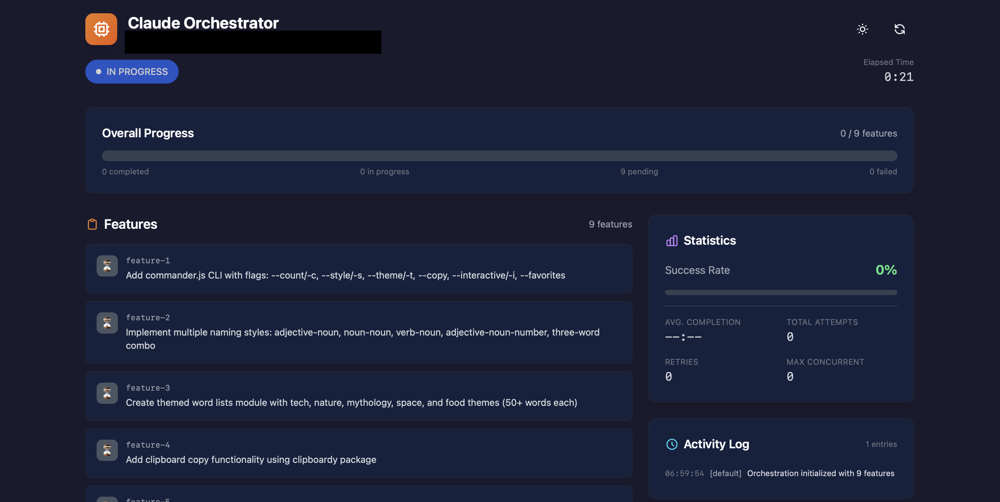
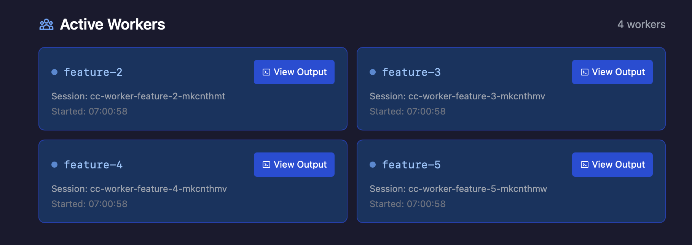

<p align="center">
  
</p>

<p align="center">
  <strong>An MCP server for orchestrating parallel Claude Code worker swarms with protocol-based behavioral governance.</strong><br>
  Enables multi-hour autonomous coding sessions with persistent state, parallel workers, and runtime enforcement of behavioral constraints.
</p>

<p align="center">
  <a href="#installation">Installation</a> •
  <a href="#quick-start">Quick Start</a> •
  <a href="#web-dashboard">Dashboard</a> •
  <a href="#protocol-system">Protocols</a> •
  <a href="#mcp-tools-reference">Tools</a>
</p>

---

## Features

### Worker Orchestration
- **Persistent State** - Session state survives context compaction via MCP server
- **Parallel Workers** - Run multiple Claude Code workers simultaneously via tmux
- **Competitive Planning** - Complex features get two competing implementation plans
- **Confidence Monitoring** - Multi-signal scoring detects struggling workers
- **Auto-retry** - Failed features automatically retry with configurable limits
- **Feature Dependencies** - Define execution order between features
- **Post-Completion Reviews** - Automated code and architecture reviews with actionable findings

### Protocol-Based Governance
- **Behavioral Protocols** - Define constraints on what workers can/cannot do
- **Pre-spawn Validation** - Verify protocols allow task before worker starts
- **Continuous Monitoring** - Track constraint violations during execution
- **LLM-Generated Protocols** - Workers can propose new protocols (validated against base constraints)
- **Cross-instance Sync** - Share protocols across MCP instances

### Monitoring & Dashboard
- **Real-time Web Dashboard** - Live UI at `http://localhost:3456` with Server-Sent Events
- **Live Terminal Streaming** - Watch worker output with ANSI color support
- **Review Worker Visibility** - Code and architecture review progress in dashboard
- **Violation Tracking** - Audit log of all protocol violations
- **Git Checkpoints** - Commit progress after each feature

### Repository Setup
- **Auto-Configuration** - Set up CI/CD, issue templates, and documentation in parallel
- **Platform Detection** - GitHub, GitLab, Gitea, Bitbucket, Azure DevOps support
- **Project Analysis** - Detects languages, frameworks, and adapts configuration
- **Merge Mode** - Preserves existing configs by default, with optional force overwrite

## How It Works

The orchestrator pattern separates concerns for reliable long-running sessions:

- **Orchestrator (Claude Code)**: Plans work, monitors progress, makes decisions
- **MCP Server**: Maintains persistent state that survives context compaction
- **Workers**: Isolated Claude Code sessions in tmux that implement individual features
- **Protocols**: Behavioral constraints governing what workers can/cannot do

This separation enables:
- **Parallel execution**: Multiple workers implement features simultaneously
- **State persistence**: Session state survives context compaction via the MCP server
- **Failure recovery**: Workers can retry, rollback, or be guided when stuck
- **Behavioral governance**: Protocols enforce constraints on worker actions

## Quick Start

### Prerequisites

- Node.js 18+
- tmux (`brew install tmux` on macOS)
- Claude Code CLI

### Installation

**One-liner install** (recommended):

```bash
curl -fsSL https://raw.githubusercontent.com/cj-vana/claude-swarm/main/install.sh | bash
```

This will clone the repo, build, register the MCP server, and install the `/swarm` skill.

<details>
<summary><strong>Manual installation</strong></summary>

```bash
git clone https://github.com/cj-vana/claude-swarm.git
cd claude-swarm
npm install
npm run build

# Add to Claude Code
claude mcp add claude-swarm --scope user -- node $(pwd)/dist/index.js

# Install the skill (optional but recommended)
mkdir -p ~/.claude/skills/swarm && cp skill/SKILL.md ~/.claude/skills/swarm/
```

</details>

### Basic Usage

Tell Claude to use the swarm:

```
Use /swarm to build a REST API with authentication, user management, and tests
```

Or follow the workflow phases manually:

```
Phase 1: Setup
  → orchestrator_init - Initialize session with features
  → configure_verification - Set up test/build commands
  → set_dependencies - Define feature order

Phase 2: Pre-Work (per feature)
  → get_feature_complexity - Check if competitive planning needed
  → enrich_feature - Add relevant context

Phase 3: Execute
  → start_worker or start_parallel_workers

Phase 4: Monitor
  → sleep 180 - Wait before checking
  → check_worker (heartbeat: true) - Lightweight status
  → send_worker_message - Guide if stuck

Phase 5: Complete
  → run_verification - Run tests
  → mark_complete - Record success/failure
  → commit_progress - Git checkpoint

Phase 6: Review
  → check_reviews - Monitor automated reviews
  → get_review_results - See findings
```

### The `/swarm` Skill

The `/swarm` skill provides guided orchestration with a complete workflow:

```
Use /swarm to build a REST API with authentication, user management, and tests
```

The skill automates:
- **Phase 0**: Repository readiness check (runs `setup_analyze`)
- **Phase 1**: Session setup with feature decomposition
- **Phase 2**: Pre-work preparation (complexity analysis, context enrichment)
- **Phase 3**: Execution (manual or auto-orchestration)
- **Phase 4**: Monitoring loop with confidence tracking
- **Phase 5**: Completion verification and git checkpoints
- **Phase 6**: Post-completion reviews

**Installing the skill:**
```bash
mkdir -p ~/.claude/skills/swarm && cp skill/SKILL.md ~/.claude/skills/swarm/
```

See `skill/SKILL.md` for the complete workflow reference.

## Protocol System

Protocols define behavioral constraints that govern worker actions, enabling safe autonomous operation with clear boundaries.

### Constraint Types

| Type | Description | Example |
|------|-------------|---------|
| `tool_restriction` | Allow/deny specific tools | Only allow Read, Glob, Grep |
| `file_access` | Control file system access | Block access to `.env` files |
| `output_format` | Require specific output patterns | Must include test coverage report |
| `behavioral` | High-level behavior rules | Require confirmation before destructive actions |
| `temporal` | Time-based constraints | Max 30 minutes per feature |
| `resource` | Resource usage limits | Max 100 file operations |
| `side_effect` | Control external effects | No network requests, no git push |

### Example Protocol

```json
{
  "id": "safe-refactoring-v1",
  "name": "Safe Refactoring Protocol",
  "version": "1.0.0",
  "priority": 100,
  "constraints": [
    {
      "id": "no-secrets",
      "type": "file_access",
      "rule": {
        "type": "file_access",
        "deniedPaths": ["**/.env", "**/secrets.*", "**/credentials.json"]
      },
      "severity": "error",
      "message": "Cannot access files that may contain secrets"
    }
  ],
  "enforcement": {
    "mode": "strict",
    "preExecution": true,
    "postExecution": true,
    "onViolation": "block"
  }
}
```

### Protocol Workflow

```
1. protocol_register - Register a new protocol
2. protocol_activate - Activate for enforcement
3. start_worker - Workers are validated against active protocols
4. [worker runs with continuous monitoring]
5. get_violations - Review any constraint violations
```

### LLM-Generated Protocols

Workers can propose new protocols validated against immutable base constraints:

```
1. get_base_constraints - View immutable security rules
2. propose_protocol - Worker submits proposal
3. review_proposals - See pending proposals with risk scores
4. approve_protocol / reject_protocol - Human review for high-risk
```

**Base Constraints** (cannot be overridden):
- Certain tools always denied (e.g., dangerous system commands)
- Critical paths always protected (e.g., `/etc`, system files)
- Maximum privilege ceiling enforced

## Competitive Planning

For complex features, spawn two planners with different approaches:

```
1. get_feature_complexity(featureId)     # Analyze complexity (0-100)
2. start_competitive_planning(featureId) # Spawn Planner A & B
3. [wait for planners to complete]
4. evaluate_plans(featureId)             # Compare and pick winner
5. start_worker(featureId)               # Implement with winning plan
```

- **Planner A**: Incremental, safe approach
- **Planner B**: Elegant, innovative approach
- **Threshold**: Features scoring 60+ trigger competitive planning

## Confidence Monitoring

Real-time confidence scoring detects struggling workers:

| Signal | Weight | Measures |
|--------|--------|----------|
| Tool Activity | 35% | Read->Edit->Test cycles, stuck loops |
| Self-Reported | 35% | Worker writes to `.confidence` file |
| Output Analysis | 30% | Error patterns, frustration language |

**Levels**: High (80-100), Medium (50-79), Low (25-49), Critical (0-24)

```
set_confidence_threshold(35)       # Configure alert level
get_worker_confidence(featureId)   # Get detailed breakdown
```

## Auto-Orchestration

For fully autonomous execution, use `auto_orchestrate`:

```
auto_orchestrate(projectDir, strategy: "adaptive", maxConcurrent: 5)
```

This handles Phases 3-5 automatically:
- Schedules workers based on dependencies
- Monitors progress and handles failures
- Runs verification commands
- Marks features complete
- Commits progress at checkpoints

### Scheduling Strategies

| Strategy | Behavior |
|----------|----------|
| `breadth-first` | Maximize parallel execution of independent features |
| `depth-first` | Focus on unblocking dependent feature chains |
| `adaptive` | System decides based on dependency graph (default) |

### When to Use

- **Auto-orchestration**: Large feature sets, hands-off execution
- **Manual orchestration**: Fine-grained control, complex dependencies, debugging

## Post-Completion Reviews

Automated code and architecture reviews run after all workers complete:

```
1. All features complete -> session status changes to "reviewing"
2. Code review worker analyzes: bugs, security, style, test coverage
3. Architecture review worker analyzes: coupling, patterns, scalability
4. Findings aggregated into progress log
5. Session completes with review summary
```

Review workers output structured JSON findings:
- `.claude/orchestrator/workers/code-review.findings.json`
- `.claude/orchestrator/workers/architecture-review.findings.json`

**Severity levels**: clean, minor, moderate, major, critical

### Acting on Review Findings

Convert review findings into actionable features:

```
# View available issues from reviews
implement_review_suggestions(projectDir)

# Create features from specific issues
implement_review_suggestions(projectDir, issueIndices: [0, 2, 5])

# Auto-select warnings and errors
implement_review_suggestions(projectDir, autoSelect: true, minSeverity: "warning")
```

Configure or trigger manually:
```
configure_reviews(enabled: true, skipOnFailure: false)
run_review(reviewTypes: ["code", "architecture"])
get_review_results(format: "detailed")
```

## Repository Setup

Automatically configure repositories with development best practices:

```
# Analyze repository freshness and missing configs
setup_analyze(projectDir)

# Initialize setup with parallel workers
setup_init(projectDir)

# Check setup progress
setup_status(projectDir)
```

### Configuration Types

| Type | Description | Files Created |
|------|-------------|---------------|
| **CLAUDE.md** | Project guidance for Claude Code | `CLAUDE.md` |
| **GitHub CI** | Build, test, lint workflows | `.github/workflows/ci.yml` |
| **Dependabot** | Automated dependency updates | `.github/dependabot.yml` |
| **Release Please** | Automated version bumps and changelogs | `.github/workflows/release-please.yml` |
| **Issue Templates** | Structured bug/feature reporting | `.github/ISSUE_TEMPLATE/*.yml` |
| **PR Template** | Consistent pull request descriptions | `.github/PULL_REQUEST_TEMPLATE.md` |
| **CONTRIBUTING.md** | Contribution guidelines | `CONTRIBUTING.md` |
| **SECURITY.md** | Security policy and vulnerability reporting | `SECURITY.md` |

### Customization

```bash
# Skip specific config types
setup_init(projectDir, skipConfigs: ["dependabot", "release-please"])

# Force overwrite existing files
setup_init(projectDir, force: true)

# Override platform detection
setup_init(projectDir, platform: "gitlab")
```

## Feature Rollback

The orchestrator creates git snapshot branches before each worker starts, enabling safe rollback of failed features.

### How Rollback Works

1. **Snapshot Creation**: `start_worker` creates `swarm/{featureId}` branch at current HEAD
2. **Worker Execution**: Worker makes changes to working directory
3. **On Failure**: Use `rollback_feature` to restore pre-worker state

### Rollback Tools

| Tool | Description |
|------|-------------|
| `rollback_feature` | Restore files changed by a worker |
| `check_rollback_conflicts` | Check for conflicts with other workers |

### Usage

```
# Rollback all files changed by feature
rollback_feature(projectDir, featureId: "feature-1")

# Rollback specific files only
rollback_feature(projectDir, featureId: "feature-1", files: ["src/component.ts"])
```

**Warning**: When rolling back in parallel worker environments, other workers' changes to the same files will also be reverted.

## Web Dashboard





A real-time web dashboard is available at `http://localhost:3456`:

- **Session Overview** - Progress bar, feature counts, session statistics
- **Feature Cards** - Status, dependencies, worker assignment
- **Live Terminal Output** - Real-time streaming with ANSI color support
- **Review Worker Progress** - Code and architecture review visibility
- **Dark Mode** - Automatic theme detection

### Dashboard API

The dashboard exposes a REST API for programmatic access:

| Endpoint | Method | Description |
|----------|--------|-------------|
| `/api/status` | GET | Session overview with elapsed time and progress summary |
| `/api/features` | GET | Feature list with details (supports `?status=` filter) |
| `/api/workers` | GET | All worker statuses with summary counts |
| `/api/workers/:featureId/output` | GET (SSE) | Stream worker terminal output in real-time |
| `/api/review-workers` | GET | Review worker statuses and findings summary |
| `/api/review-workers/:type/output` | GET (SSE) | Stream review worker output |
| `/api/logs` | GET | Progress log entries (supports `?limit=N`) |
| `/api/stats` | GET | Session statistics (completion times, success rates) |
| `/api/events` | GET (SSE) | Real-time updates for all session changes |
| `/health` | GET | Health check endpoint |

**Server-Sent Events** (`/api/events`):
- `status` - Session status changes
- `feature` - Feature status updates
- `worker` - Active worker count changes
- `reviewWorker` - Review worker status updates
- `log` - New progress log entries
- `heartbeat` - Keep-alive (every 15s)

## Architecture


*Claude Code orchestrates workers through the MCP Server. Workers run in isolated tmux sessions and share access to the project codebase. The dashboard provides real-time monitoring via SSE.*

## MCP Tools Reference

### Core Orchestration (3 tools)
| Tool | Description |
|------|-------------|
| `orchestrator_init` | Start session with task and features |
| `orchestrator_status` | Get current state (use after compaction) |
| `orchestrator_reset` | Clear state and kill all workers |

### Worker Management (6 tools)
| Tool | Description |
|------|-------------|
| `start_worker` | Launch worker for a feature |
| `start_parallel_workers` | Launch multiple workers simultaneously |
| `validate_workers` | Pre-flight validation before parallel execution |
| `check_worker` | Get worker output (supports heartbeat mode) |
| `check_all_workers` | Check all active workers at once |
| `send_worker_message` | Send instructions to running worker |

### Competitive Planning (3 tools)
| Tool | Description |
|------|-------------|
| `get_feature_complexity` | Analyze complexity score |
| `start_competitive_planning` | Spawn 2 planners with different approaches |
| `evaluate_plans` | Compare plans and select winner |

### Confidence Monitoring (2 tools)
| Tool | Description |
|------|-------------|
| `get_worker_confidence` | Get detailed confidence breakdown |
| `set_confidence_threshold` | Configure alert threshold |

### Feature Management (6 tools)
| Tool | Description |
|------|-------------|
| `mark_complete` | Mark feature done/failed (auto-retry) |
| `retry_feature` | Reset failed feature for retry |
| `run_verification` | Run tests/build commands |
| `add_feature` | Add discovered work |
| `set_dependencies` | Define feature dependencies |
| `configure_verification` | Set pre-completion verification commands |

### Pre-Completion Verification

Configure commands that workers must run before marking features complete:

```
configure_verification(projectDir, commands: ["npm test", "npx tsc --noEmit"])
```

Workers will run these commands and fix any errors before completion. Allowed commands include:
- `npm test`, `npm run test`, `yarn test`, `pnpm test`
- `npx tsc --noEmit`, `npx vitest`, `npx jest`
- `pytest`, `python -m pytest`
- `cargo test`, `cargo check`
- `go test`, `make test`

### Session & Progress (6 tools)
| Tool | Description |
|------|-------------|
| `get_progress_log` | View history (paginated) |
| `get_session_stats` | Success rates and timing |
| `pause_session` | Pause and stop all workers |
| `resume_session` | Resume paused session |
| `commit_progress` | Create git checkpoint |
| `auto_orchestrate` | Hands-free orchestration until completion |

### Feature Rollback (2 tools)
| Tool | Description |
|------|-------------|
| `rollback_feature` | Restore files changed by a worker |
| `check_rollback_conflicts` | Check for conflicts with other workers |

### Post-Completion Reviews (5 tools)
| Tool | Description |
|------|-------------|
| `run_review` | Manually trigger code/architecture reviews |
| `check_reviews` | Monitor review worker status |
| `get_review_results` | Get aggregated findings (summary/detailed/json) |
| `configure_reviews` | Set auto-review preferences |
| `implement_review_suggestions` | Convert review findings into features |

### Repository Setup (3 tools)
| Tool | Description |
|------|-------------|
| `setup_analyze` | Analyze repo freshness and missing configs |
| `setup_init` | Initialize repo configuration with parallel workers |
| `setup_status` | Check setup progress |

### Protocol Management (5 tools)
| Tool | Description |
|------|-------------|
| `protocol_register` | Register a new protocol |
| `protocol_activate` | Activate protocol for enforcement |
| `protocol_deactivate` | Deactivate protocol |
| `protocol_list` | List all registered protocols |
| `protocol_status` | Get protocol details and violations |

### Protocol Enforcement (4 tools)
| Tool | Description |
|------|-------------|
| `validate_feature_protocols` | Check if feature can run under active protocols |
| `get_violations` | Get recorded violations (paginated) |
| `resolve_violation` | Mark violation as resolved |
| `get_audit_log` | Get protocol audit history |

### LLM Protocol Generation (5 tools)
| Tool | Description |
|------|-------------|
| `get_base_constraints` | View immutable base constraints |
| `propose_protocol` | Submit a protocol proposal |
| `review_proposals` | List pending proposals with risk scores |
| `approve_protocol` | Approve a protocol proposal |
| `reject_protocol` | Reject a protocol proposal |

### Protocol Networking (4 tools)
| Tool | Description |
|------|-------------|
| `export_protocols` | Export protocols to shareable bundle |
| `import_protocols` | Import protocols from bundle |
| `sync_protocols` | Sync with peer instances |
| `discover_protocols` | Discover peer MCP instances |

### Context Management (4 tools)
| Tool | Description |
|------|-------------|
| `enrich_feature` | Auto-enrich feature with relevant docs and code |
| `set_feature_context` | Manually set feature context |
| `get_feature_graph` | View feature dependency graph with context |
| `route_feature` | Configure worker routing preferences |

## Files Created

```
your-project/
├── .claude/orchestrator/
│   ├── state.json              # Session state
│   ├── feature_list.json       # Feature status
│   ├── protocols/
│   │   ├── registry.json       # Protocol definitions
│   │   ├── active.json         # Active protocols
│   │   ├── violations.json     # Violation records
│   │   ├── audit.json          # Audit log
│   │   └── proposals/          # Pending proposals
│   ├── sync/                   # Cross-instance sync
│   └── workers/
│       ├── *.prompt            # Worker prompts
│       ├── *.log               # Worker output logs
│       ├── *.done              # Completion markers
│       ├── *.status            # Worker status
│       ├── *.plan.json         # Competitive plans
│       ├── *.confidence        # Self-reported confidence
│       ├── code-review.findings.json        # Code review results
│       └── architecture-review.findings.json # Architecture review results
├── claude-progress.txt         # Human-readable log
└── init.sh                     # Environment setup
```

## Configuration

| Variable | Default | Description |
|----------|---------|-------------|
| `DASHBOARD_PORT` | `3456` | Dashboard HTTP port |
| `ENABLE_DASHBOARD` | `true` | Set to `false` to disable |

## Security

### Input Validation
- **Path traversal protection** - All file paths validated against project directory
- **Cryptographically secure IDs** - Uses `crypto.randomUUID()`
- **Symlink escape prevention** - Real paths validated before file operations
- **Input validation** - All inputs validated with Zod schemas

### Regex Safety (ReDoS Protection)
- **Pattern validation** - `isDangerousRegexPattern()` detects catastrophic backtracking
- **Safe regex testing** - `safeRegexTest()` falls back to literal matching for dangerous patterns
- **Glob-to-regex conversion** - Proper metacharacter escaping prevents injection

### Memory Safety
- **Bounded collections** - Operation counts, alerts, and observed patterns have maximum limits
- **LRU eviction** - Least-recently-used entries removed when limits reached (max 50 cached managers)
- **Timestamp truncation** - Historical data pruned to prevent unbounded growth

### Network Safety
- **Localhost-only CORS** - Dashboard only accepts requests from localhost origins
- **No external network access** - Workers operate in isolated tmux sessions

### Execution Safety
- **Fail-closed enforcement** - Unknown constraint types block by default
- **Command allowlist** - Only safe verification commands allowed
- **No shell injection** - Uses `execFile` with arguments, prompts via files
- **Circuit breaker pattern** - Monitor auto-stops after repeated failures
- **Review worker isolation** - Read-only tools (no Bash access)

### Protocol Security
- **Base constraints** - Immutable security rules cannot be overridden
- **Proposal validation** - LLM-generated protocols checked against security boundaries
- **Token-based matching** - Tool prohibition uses exact token matching, not substring

## Inspiration

- [Anthropic's "Effective harnesses for long-running agents"](https://www.anthropic.com/engineering/effective-harnesses-for-long-running-agents)
- [MAKER: "Solving a Million-Step LLM Task with Zero Errors"](https://arxiv.org/abs/2511.09030)
- [Multi-Agent Collaboration via Evolving Orchestration](https://arxiv.org/abs/2505.19591)
- [AFlow: Automatic Workflow Optimization](https://arxiv.org/abs/2410.10762)
- [AgentsNet: Coordinating Multi-Agent Networks](https://arxiv.org/html/2507.08616v1)

## Troubleshooting

### "No active session"
Run `orchestrator_status` to check state, or `orchestrator_init` to start fresh.

### Worker seems stuck
1. `check_worker(featureId)` to see current output
2. `get_worker_confidence(featureId)` to check confidence score
3. `send_worker_message(featureId, "guidance")` to provide direction
4. If truly stuck, `mark_complete(featureId, success: false)` triggers auto-retry

### Lost context after compaction
Call `orchestrator_status(projectDir)` - the MCP server maintains all state externally.

### Feature has unmet dependencies
1. Check dependencies with `orchestrator_status`
2. Complete dependency features first
3. Or use `set_dependencies` to modify the chain

### Protocol violations blocking work
1. `get_violations()` to see what was violated
2. `resolve_violation(violationId, resolution)` if false positive
3. Adjust protocol constraints if too restrictive

### Debugging tmux sessions
```bash
# List all worker sessions
tmux list-sessions | grep cc-worker

# Attach to a worker session
tmux attach -t cc-worker-feature-1-abc123

# Capture recent output
tmux capture-pane -t <session-name> -p -S -100
```

### Monitor stops unexpectedly
The monitor auto-stops after 5 consecutive errors (circuit breaker). Check MCP server logs and restart if needed.

## Limitations

- Requires tmux (WSL on Windows)
- Workers use your Claude Code subscription
- Protocol enforcement is observational (monitors but doesn't intercept tool calls)
- Complex feature detection is heuristic-based

## Contributing

Contributions welcome! See [CONTRIBUTING.md](CONTRIBUTING.md) for guidelines.

## License

MIT
